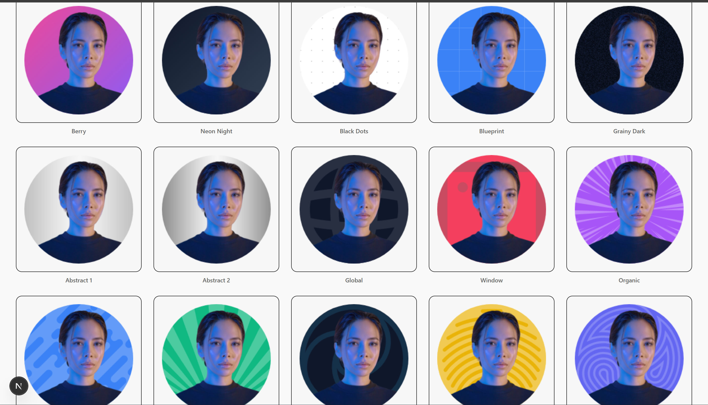

# PfpStudio




Create stunning animated profile pictures for social media. Zero design skills required.

##  Contributing

We welcome contributions! Here are some tips to get started:

1.  **Fork the repo** and clone it locally.
2.  **Install dependencies** using Bun:
    ```bash
    bun install
    ```
3.  **Run the development server**:
    ```bash
    bun dev
    ```
4.  **Make your changes**. Please follow the existing code style (Prettier/ESLint).
5.  **Test your changes** to ensure nothing is broken.
6.  **Push to your fork** and submit a **Pull Request**.

### 💡 Tips for Contributors

*   **Components**: We use `shadcn/ui` components. Check `components/ui` before creating new primitive components.
*   **Styling**: Use Tailwind CSS classes. Avoid custom CSS files if possible.
*   **Icons**: We use `@tabler/icons-react` for icons.
*   **State Management**: We use React Context (`lib/profile-context.tsx`) for managing global state like the uploaded image and editor settings.

